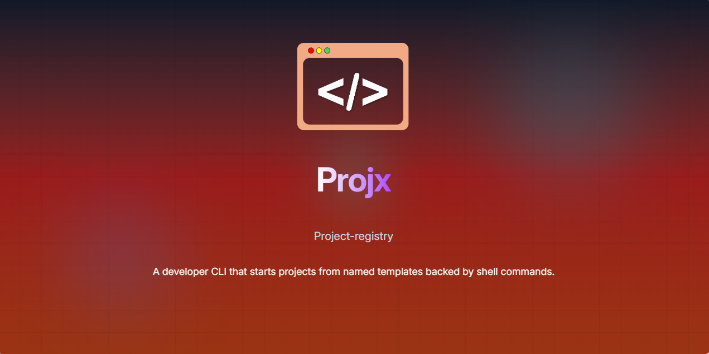

# project-registry – `projx`

A CLI tool to save and run command templates with variables.

[](https://npmjs.org/package/project-registry)
[](https://npmjs.org/package/project-registry)
[](https://github.com/HichemTab-tech/project-registry/blob/master/LICENSE)




## Installation

```bash
npm install -g project-registry
```

or

```bash
pnpm add -g project-registry
```


## Quick Start

### 1. Add a simple template

A template is just **a name mapped to one or more commands**.

```bash
projx add react "pnpm create vite . --template react"
```

### 2. Run it

```bash
projx react
```

That’s it ^.^


## Using variables

Templates can contain variables using the `{{variable}}` syntax.

Example:

```bash
projx add react \
  "pnpm create vite {{name}} --template react" \
  "cd {{name}}" \
  "pnpm install"
```

### Variables with description

You can provide a description for a variable to make the prompt more helpful using `{{variable::description}}` syntax:

```bash
projx add my-template "echo {{name::Enter the project name}}"
```

If you use the same variable multiple times, you only need to add the description once:

```bash
projx add my-template \
  "echo Creating {{name::Project Name}}" \
  "mkdir {{name}}" \
  "cd {{name}}"
```

Run it by passing values:

```bash
projx react my-app
```

If a value is missing, `projx` will **ask for it automatically**.

Variables are optional — if you don’t need them, don’t use them.

## Running templates (name or select)

### Run directly by name

```bash
projx react my-app
```

This is the fastest way if you remember the name.

### Use interactive selection (recommended)

If you don’t remember the exact name:

```bash
projx select
```

You’ll get a numbered list and can pick one.

#### Filtering templates

You can filter the list when you have many templates:

```bash
projx select -f rea
```

Example:

* `react`
* `react-ts`
* `react-shadcn`

This makes `select` the **default workflow** for many users.

## Commands

### `projx add <name> <commands...>`

Register a new template with one or more commands.

```bash
# Basic usage
projx add <name> "command1" "command2" "command3"

# With description
projx add <name> -d "My template description" "command1" "command2"

# Interactive mode
projx add
```

Variables use `{{variable}}` syntax and are resolved at run time.

### `projx run <name> [values...]`

Run a registered template.

```bash
# Pass variable values as arguments
projx run react my-app

# Force interactive mode
projx run react -i
```

### `projx <name> [values...]`

Shortcut for `projx run`.

```bash
projx react my-app
```

### `projx list`

List all registered templates.

```bash
# Table format (default)
projx list
projx list -c        # show commands
projx list --no-table
```

### `projx select`

Interactively select and run a template.

```bash
projx select
projx select -f react   # filter by name
```

### `projx remove <name>`

Remove a template.

```bash
projx remove react
projx remove -s      # interactive selection
projx remove -y      # skip confirmation
```

## Examples

### Project templates

```bash
# React + Vite
projx add react \
  "pnpm create vite {{name}} --template react-ts" \
  "cd {{name}}" \
  "pnpm install" \
  "code ."

# Next.js
projx add next "pnpm create next-app {{name}}" "cd {{name}}" "code ."

# Express API
projx add express "mkdir {{name}}" "cd {{name}}" "pnpm init -y" "pnpm add express" "code ."
```

### Dev shortcuts

```bash
# Git quick commit
projx add gc "git add ." "git commit -m '{{message}}'" "git push"

# Docker compose
projx add dcu "docker compose up -d"
projx add dcd "docker compose down"

# SSH to server
projx add ssh-prod "ssh {{user}}@production-server.com"
```

## Not just for projects

`projx` works for **any repeatable command sequence**:

* Git workflows
* Docker commands
* SSH shortcuts
* Build & deploy scripts
* System utilities

It’s a **command template registry**, not just a project generator.

## Config location

Templates are stored at:

```
~/.project-registry/config.json
```

---

## 🤝 Contributions

Contributions are welcome! Please follow the standard fork-and-pull-request workflow.

## Issues

If you encounter any issue, please open an issue [here](https://github.com/HichemTab-tech/project-registry/issues).

## License

Distributed under the MIT License. See [`LICENSE`](LICENSE) file for more details.

&copy; 2026 [Hichem Taboukouyout](mailto:hichem.taboukouyout@hichemtab-tech.me)

---

_If you found this package helpful, consider leaving a star! ⭐️_
