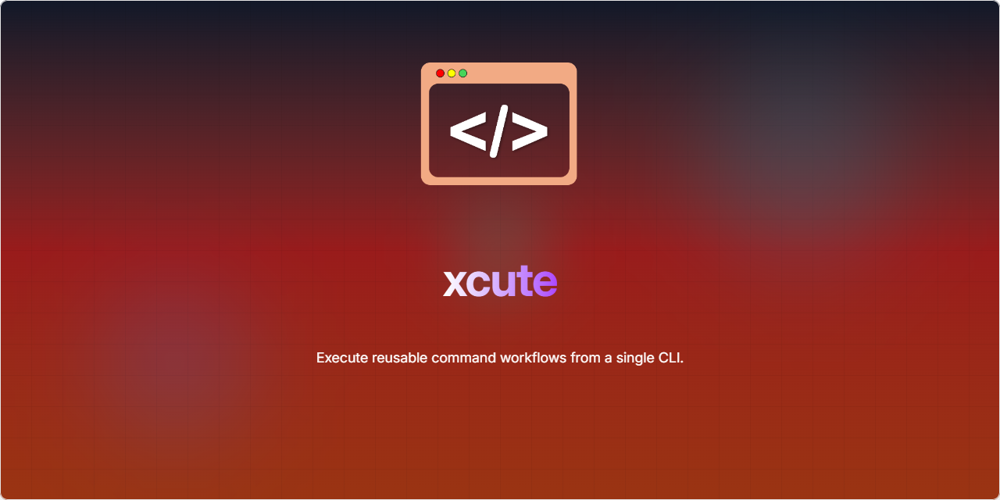

# xcute

A CLI to save, reuse, and execute command actions.

> _Previously known as **project-registry**_

[](https://npmjs.org/package/xcute)
[](https://npmjs.org/package/xcute)
[](https://github.com/HichemTab-tech/xcute/blob/master/LICENSE)




## Installation

**Requirements:**
- Node.js version **21.0.0** or higher.

```bash
npm install -g xcute
```

or

```bash
pnpm add -g xcute
```


## Quick Start

### 1. Add a simple action

An action is just **a name mapped to one or more commands**.

```bash
xcute add react "pnpm create vite . --action react"
```

### 2. Run it

```bash
xcute react
```

That’s it ^.^


## Using variables

Actions can contain variables using the `{{variable}}` syntax.

Example:

```bash
xcute add react \
  "pnpm create vite {{name}} --action react" \
  "cd {{name}}" \
  "pnpm install"
```

### Variables with description

You can provide a description for a variable to make the prompt more helpful using `{{variable::description}}` syntax:

```bash
xcute add my-action "echo {{name::Enter the project name}}"
```

If you use the same variable multiple times, you only need to add the description once:

```bash
xcute add my-action \
  "echo Creating {{name::Project Name}}" \
  "mkdir {{name}}" \
  "cd {{name}}"
```

### Variables with default values

You can provide a default value using `{{variable|default}}` syntax:

```bash
xcute add my-action "code {{path|.}}"
```

You can combine description and default value with `{{variable::description|default}}`:

```bash
xcute add my-action "echo {{name::Project Name|my-app}}"
```

Resolution order is:

1. Passed CLI value
2. Variable default value
3. Interactive prompt

Run it by passing values:

```bash
xcute react my-app
```

If a value is missing, `xcute` will **ask for it automatically**.

Variables are optional — if you don’t need them, don’t use them.

## Running actions (name or select)

### Run directly by name

```bash
xcute react my-app
```

This is the fastest way if you remember the name.

### Use interactive selection (recommended)

If you don’t remember the exact name:

```bash
xcute select # or xcute s
```

You’ll get a numbered list and can pick one.

#### Filtering actions

You can filter the list when you have many actions:

```bash
xcute select -f rea
```

Example:

* `react`
* `react-ts`
* `react-shadcn`

This makes `select` the **default workflow** for many users.

## Commands

### `xcute add <name> <commands...>`

Register a new action with one or more commands.

```bash
# Basic usage
xcute add <name> "command1" "command2" "command3"

# With description
xcute add <name> -d "My action description" "command1" "command2"

# Interactive mode
xcute add
```

Variables use `{{variable}}` syntax and are resolved at run time.

### `xcute run <name> [values...]`

Run a registered action.

On Unix-like systems, actions are executed through your current shell from `$SHELL` in interactive mode when available, so aliases and shell functions from your normal CLI are available there too.

```bash
# Pass variable values as arguments
xcute run react my-app

# Force interactive mode
xcute run react -i
```

### `xcute <name> [values...]`

Shortcut for `xcute run`.

```bash
xcute react my-app
```

### `xcute list`

List all registered actions.

```bash
# Table format (default)
xcute list
xcute list -c        # show commands
xcute list --no-table
```

### `xcute select`

Interactively select and run a action.

```bash
xcute select
xcute select -f react   # filter by name
```

### `xcute remove <name>`

Remove a action.

```bash
xcute remove react
xcute remove -s      # interactive selection
xcute remove -y      # skip confirmation
```

### `xcute export <path>`

Export your action registry to a JSON file (backup).

```bash
# Export to a file
xcute export backup.json

# Export to a directory (creates xcute.json)
xcute export ./backups/
```

### `xcute import <path>|<url>`

Import action from a JSON file or URL.

```bash
# Import from local file (merges with existing)
xcute import backup.json

# Import from URL
xcute import https://example.com/shared-actions.json

# Import from file and replace ALL existing actions
xcute import backup.json --replace
```

### `xcute self-update [package-manager]`

Update the CLI to the latest version.

```bash
# Update using pnpm (default)
xcute self-update

# Update using npm
xcute self-update npm

# Update using yarn
xcute self-update yarn
```

## Examples

### Project templates

```bash
# React + Vite
xcute add react \
  "pnpm create vite {{name}} --action react-ts" \
  "cd {{name}}" \
  "pnpm install" \
  "code ."

# Next.js
xcute add next "pnpm create next-app {{name}}" "cd {{name}}" "code ."

# Express API
xcute add express "mkdir {{name}}" "cd {{name}}" "pnpm init -y" "pnpm add express" "code ."
```

### Dev shortcuts

```bash
# Git quick commit
xcute add gc "git add ." "git commit -m '{{message}}'" "git push"

# Docker compose
xcute add dcu "docker compose up -d"
xcute add dcd "docker compose down"

# SSH to server
xcute add ssh-prod "ssh {{user}}@production-server.com"
```

## Config location

Actions are stored at:

```
~/.xcute/config.json
```

---

## 🤝 Contributions

Contributions are welcome! Please follow the standard fork-and-pull-request workflow.

## Issues

If you encounter any issue, please open an issue [here](https://github.com/HichemTab-tech/xcute/issues).

## License

Distributed under the MIT License. See [`LICENSE`](LICENSE) file for more details.

&copy; 2026 [Hichem Taboukouyout](mailto:hichem.taboukouyout@hichemtab-tech.me)

---

_If you found this package helpful, consider leaving a star! ⭐️_
